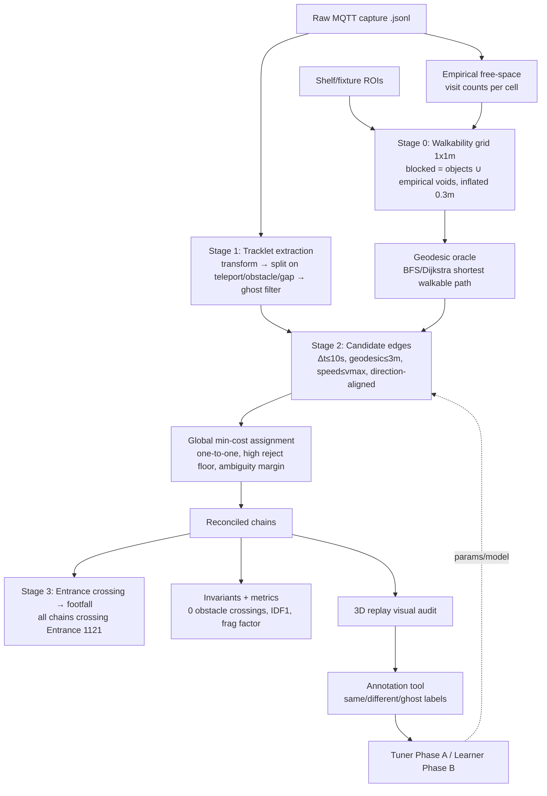

# Map-Constrained Trajectory Reconciliation (v2) — Design for Review

**Status:** DRAFT for review — no production changes until approved
**Scope:** Offline post-process reconciler (replay/benchmark) first; live reconciler second
**Author/Context:** Trajectory reconciliation redesign for TREVIGLIO grocery (venue `55fdd53b-3298-4355-97c0-b4e789b11d06`)

---

## 1. Problem & current-state diagnosis

The current reconcilers (`backend/services/TrajectoryReconciler.js` live, `backend/services/offline/BatchTrajectoryReconciler.js` post-process) produce visually wrong trajectories: tracks **jump across the store** and **pass through shelves**. Root causes, confirmed in code:

| # | Defect | Where |
|---|---|---|
| 1 | All distances are **straight-line Euclidean**; no wall/shelf awareness | `mergeFragments()` uses `Math.hypot` only |
| 2 | Re-ID **predicts across obstacles** (`pred = end + exitVel·dt`) then links to nearest | `BatchTrajectoryReconciler.js` L151–155 |
| 3 | **Greedy union-find** chains A→B→C → cascading teleport mega-tracks | L168–182 |
| 4 | Gates far looser than physical reality: `GROCERY_BALANCED` = **~11 m / 18 s** | `offlineReconcilePresets.js` (`reid_max_distance_m:9` + `merge_distance_bonus_m:2`) |
| 5 | A raw perception ID that itself teleports is **never split** | no split stage exists |
| 6 | **No entrance anchoring**; identities not seeded where people enter | — |

### MQTT feed reality (measured on capture `0106_1618`)
Per message: `id, timestamp, position{x,y,z}, velocity{x,y,z}, objectType, boundingBox{w,h,d}, color`.
- **`color` is NOT appearance** — 8 palette values across 2,112 IDs, exactly 1 per ID (a render color). **Dropped.**
- **`boundingBox` is noisy** — median height 1.02 m but ~0.5 m intra-track jitter (p90 0.95 m). **Soft prior only**, never a gate.
- **Conclusion: no reliable appearance signal.** Association must be **motion + map + geometry**, and therefore **conservative** (nothing catches an ID swap).

---

## 2. Goals, non-goals, success criteria

**Goals**
- Trajectories that are **continuous, realistic, obstacle-free**, audited visually.
- **Zero** obstacle crossings and **zero** super-human speeds in the output.
- Footfall = **all reconciled chains crossing `Entrance 1121`**.
- Fragmentation target **≤ ~20 chains per real entrant** — but the real bar is *correctness*, not a small count. (Today `GROCERY_BALANCED` already lands ~18/entrant, but via wrong merges. We want ≤20 with **no shelf-crossing and no ID swaps**.)

**Non-goals**
- Not aiming for one perfect full-length track per person. Splitting into several **consistent** sub-trajectories is acceptable (your rule 6).
- Not using `color`; not depending on appearance.

**Success metrics** (§7)
- Hard invariants pass (0 obstacle/speed violations).
- IDF1 / ID-switches vs human labels improve over current.
- Visual audit sign-off per capture.

---

## 3. Locked decisions (from review Q&A)

1. **Walkability = objects are non-walkable.** Build from the 57 shelf/fixture ROI polygons **∪** empirical never-visited cells, inflated by body radius; distances are **geodesic** (walk-around).
2. **Footfall = all chains crossing the gate** (entrance-anchoring is a confidence signal, not a filter).
3. **Bias = high precision / fewer false merges.** Tight gates, ambiguity margin, prefer no-merge; accept more fragments.
4. **Appearance** = `color` dropped; bbox height only a low-weight tie-breaker.

---

## 4. Coordinate frames (must stay consistent)

Perception → floor (`PerceptionTransform.perceptionToFloor`, `ros_rep103`: `floor.z = −perc.y`) → venue meters (`applyTransformToPoint`, origin `(21.5,24)`, rot `−39°`). **ROIs, the walkability grid, and reconciled output all live in venue meters `{x,z}`.** This is the same frame used by `isPointInPolygon` for ROI membership.

---

## 5. Architecture overview



---

## 6. Detailed design

### Stage 0 — Walkability grid + geodesic oracle (your rule 1)

**Grid.** 1×1 m cells over venue bounds (≈ `x[-15,60] z[-5,70]` → ~75×75 = ~5,600 cells), **refined to 0.5 m within ~8 m of the entrance** and along main aisles (finer geodesics where flow matters). Implemented as a base 1 m grid with a 0.5 m overlay region; geodesic queries use the finer cells where available. Each cell ∈ {FREE, BLOCKED}.

**Blocked from three combined sources:**
1. **Objects/fixtures** — rasterize the 57 shelf/fixture ROI polygons → BLOCKED.
2. **Empirical voids** — accumulate per-cell visit counts across *all* recordings; a cell with `visits == 0` that is enclosed by blocked/edge → BLOCKED. (The dark voids in the density heatmaps are the shelves.)
3. **Inflation** — dilate BLOCKED by 1 cell (≈0.3–0.5 m body radius) so paths don't graze fixtures.
4. **Manual override mask** — editable in the annotation tool for corrections.

A cell is FREE only if not blocked by any source.

**Geodesic oracle.** Precompute walkable connectivity (8-neighbour, octile distance). Provide:
- `geo(a, b)` → shortest walkable distance (∞ if no path), via A* with octile heuristic, results memoized.
- `path(a, b)` → the cell polyline (for direction checks + rendering).

```text
build_walkability(rois, recordings):
    grid = FREE everywhere within bounds
    for poly in shelf_fixture_rois: rasterize(poly) -> BLOCKED
    visits = histogram2d(all detection points, 1m cells)
    for cell where visits==0 and not boundary-open: BLOCKED
    grid = dilate(BLOCKED, 1 cell)
    return grid

geo(a,b): A*(grid, a, b, heuristic=octile)   # cached
```

Complexity: trivial at this grid size; cache geodesic queries by (cellA,cellB).

---

### Stage 1 — Tracklet extraction = **split, then clean** (your rules 4, 5)

Take each raw perception `id`'s time-ordered samples (in venue meters). **Cut** the polyline at any sample boundary where a step is physically impossible:

- **Teleport:** implied speed `|Δp|/Δt > v_max` (2.2 m/s) → cut.
- **Obstacle crossing:** the straight segment `p_{k-1}→p_k` passes through a BLOCKED cell **and** no short geodesic detour exists (`geo > 1.3·euclid`) → cut.
- **Time gap:** `Δt > gap_split` (e.g., 1.5 s with no samples) → cut.

Then **drop ghosts**:
- total displacement `< min_disp` (e.g., 0.8 m), or
- lifetime `< min_life` (e.g., 0.8 s), or
- stationary fixture: stays within `static_disp` (0.35 m) for `> static_timeout` (your **10 s** stop rule) → end the tracklet (do not bridge across it).

**Output — atomic tracklet** (each is individually realistic, never crosses a shelf):

```text
Tracklet {
  tracklet_id     # deterministic: hash(capture_id, raw_id, split_index)
  raw_id
  samples[]       # {t, x, z, vx, vz, h}
  t_start, t_end
  start_cell, end_cell
  entry_vel, exit_vel       # averaged over first/last ~0.5s
  total_disp, path_len
  median_height             # weak appearance prior
}
```

---

### Stage 2 — Map-aware association (the math)

We link a tracklet **end** `i` to a later tracklet **start** `j` (identity continuation). All candidates must pass **hard gates**; survivors get a **cost**; a **global one-to-one** solver picks links; a **reject floor + ambiguity margin** enforce the conservative bias.

**Hard gates** (reject if any fails):

```
Δt        = t_start(j) − t_end(i)            ∈ (0, T_max=10 s]
g         = geo(end_cell_i, start_cell_j)     ≤ min(D_max=3 m, v_max·Δt)   and finite
implied   = g / Δt                            ≤ v_max = 2.2 m/s
cos_exit  = cos(exit_vel_i, firstStep(path))  ≥ c_min = 0.0   (no reversing onto the path)
cos_entry = cos(lastStep(path), entry_vel_j)  ≥ c_min
```

Note: distance/speed use **geodesic** `g`, not Euclidean — this is the whole fix. A merge through a shelf has `g = ∞` (or a long detour) → rejected automatically.

#### 6.2.1 Tile-transition probability model (the core — motion-vector driven)

We do **not** use an ad-hoc cost. We model the **probability that the person who disappeared at the end of tracklet `i` reappears at the start of tracklet `j`**, given the motion vector, elapsed time, geometry, and the **other IDs around** (your requirement). Association = the assignment that maximizes total likelihood; cost is `−log P`.

For an end `i` at position `p_i`, velocity `v_i`, time `t_i`, local crowd density `ρ_i`, and a candidate start `j` at `p_j`, `v_j`, `t_j` (`Δt = t_j − t_i`), with geodesic distance `g = geo(p_i,p_j)` and walkable path `π`:

```
P(j | i, context) = P_walk · P_gap(Δt | ρ_i) · P_dist(g | v_i, Δt) · P_head(π,v_i,v_j) · P_size(h_i,h_j)
```

**(1) Reachability — objects cannot be crossed (hard).**
```
P_walk = 0  if  π does not exist  OR  g/euclid(p_i,p_j) > R_max (≈1.6)   else 1
```

**(2) Disappearance / gap prior — occlusion-aware via neighbours.** A track is more likely to vanish briefly when it is in a crowd (a nearby body occludes the LiDAR), so the tolerated gap grows with local density `ρ_i` (the "other IDs around"):
```
τ(ρ_i) = τ0 · (1 + β·ρ_i)            # τ0≈3s, β≈0.4 per neighbour within r=2m
P_gap  = exp(−Δt / τ(ρ_i))           # 0 if Δt > T_max (10s)
```

**(3) Displacement likelihood — driven by the motion vector.** Expected geodesic travel in `Δt` is `μ = |v_i|·Δt`; uncertainty grows with time and speed:
```
σ      = σ0 + k·|v_i|·Δt             # σ0≈0.4m, k≈0.35
P_dist = Normal(g ; μ, σ²)           # rewards arriving exactly where the velocity predicts
```
(The hard speed gate `g/Δt ≤ v_max` already removed teleports.)

**(4) Heading consistency — motion-vector direction in and out (von Mises).**
```
Δθ_exit  = angle(v_i, initial bearing of π)
Δθ_entry = angle(final bearing of π, v_j)
P_head   = vonMises(Δθ_exit; κ) · vonMises(Δθ_entry; κ)     # κ≈3
```
i.e. the person must leave `i` heading along the corridor toward `j`, and enter `j` moving the same way.

**(5) Size prior (weak).** `P_size = Normal(|h_i − h_j|; 0, σ_h²)`, `σ_h≈0.6`, low influence.

**Edge cost:** `c(i→j) = −log P(j | i, context)`.

#### 6.2.2 The "other IDs around" enter in two ways

1. **Competition (joint MAP assignment).** Every start `j` can be claimed by only one end. If another end `i'` explains `j` with higher probability, `j` is assigned to `i'` and `i` must find another continuation or terminate. Solving all ends/starts in a time window **jointly** is what uses the surrounding IDs to disambiguate — not a per-pair greedy choice.
2. **Density modulation.** `ρ_i` (count of other active tracks within `r` at `t_i`) widens the gap tolerance `τ` (occlusion) and can widen `σ` — so a vanish-in-a-crowd is forgivable, a vanish-in-empty-space is suspicious.

#### 6.2.3 No-match / exit hypothesis (this is what makes it conservative)

Each end `i` also competes against the hypothesis that **the person simply left** (reached an exit / the track legitimately ended):
```
c(i→EXIT) = −log P_exit(i)
P_exit(i)  high if: p_i near an entrance/exit ROI or venue boundary,
                    or no candidate within T_max, or low density (clean disappearance)
```
A continuation is accepted **only if it beats the exit hypothesis by a margin**. At an ambiguous junction we prefer EXIT (split) over a guess → **fewer false merges**.

#### 6.2.4 Global solver (no greedy cascades)

Sliding window of width `T_max`; build the bipartite graph (ends × {starts ∪ EXIT}); solve **min-cost assignment** (Hungarian per window / min-cost flow), constrained **one end → ≤1 start, one start ← ≤1 end**. This replaces the cascading union-find.

```
accept i→j only if:
    P(j|i) ≥ P_min                         # likelihood floor
    AND −log P(j|i) ≤ −log P_exit(i) − margin   # must beat "person left" by a margin
otherwise: i terminates (its own chain), j starts a new chain
```

#### 6.2.5 Learning (Phase B) keeps this exact structure

The parametric `P(j|i)` is replaced by a **calibrated learned** `P(same | features)` (logistic regression) over features `[g, Δt, |v_i|, Δθ_exit, Δθ_entry, detour, ρ_i, |Δh|, near_exit]`, plugged into the **same** assignment + EXIT option. Phase A first just tunes `τ0,β,σ0,k,κ,T_max,D_max,P_min,margin` to maximize IDF1 on labels.

**Chains.** Connected accepted links form an identity chain = one reconciled trajectory. Concatenate samples in time order; light EMA smoothing for render only (never move a point into a BLOCKED cell — clamp to path).

---

### Stage 3 — Entrance crossing & footfall (your choice: all chains)

Reuse the entrant logic already deployed (`analysis/gate_entrants.mjs` semantics): a chain counts as footfall if it **engages `Entrance 1121`** (presence inside + crosses a side / born-inside-exits / enters-dies-inside), no duration floor. Entrance-anchored chains (first tracklet starts at the gate) are flagged `confirmed_entry=true` as a confidence signal but **all** crossing chains are counted.

---

### Stage 4 — Output & invariants

Output chains in the same artifact format the replay panel already consumes (batch timeline). **Validate before promotion:**

- **0** chain segments cross a BLOCKED cell.
- **0** implied speeds > v_max.
- No chain bridges a > 10 s or > 3 m geodesic gap.

Any violation = hard fail (bug), surfaced in the audit.

---

## 7. Evaluation framework

**Label-free (every run):**
- `fragmentation_factor = chains / entrants` (target ≤ ~20).
- obstacle-violation rate (must be 0), speed-violation rate (0).
- mean chain length / lifetime; % chains `confirmed_entry`.

**Labeled (gold standard, from the annotation tool):**
- **IDF1**, **MOTA**, **ID-switches**, **false-merge rate**, **fragmentation**.
- Compare v2 vs current presets on the same labeled captures.

---

## 8. Annotation & training tool

### 8.1 Data schema

```text
reconcile_capture(capture_id, venue_id, source_file, frames, created_at)

reconcile_tracklet(                # materialized Stage-1 output, stable ids
  tracklet_id PK, capture_id, raw_id, t_start, t_end,
  start_x,start_z,end_x,end_z, total_disp, median_height, samples_blob)

reconcile_label(                   # human ground truth
  id PK, capture_id, annotator, created_at,
  type ∈ {SAME, DIFFERENT, GHOST, ENTRANCE_CROSS},
  tracklet_a, tracklet_b,          # SAME/DIFFERENT pairs
  person_label                      # optional group id for multi-select grouping
)

reconcile_model(                   # promoted params/model versions
  id PK, venue_id, kind ∈ {PARAMS, SCORER}, payload_json, metrics_json,
  created_at, promoted bool)
```

`tracklet_id` is deterministic (`hash(capture_id, raw_id, split_index)`) so labels stay valid across re-runs of Stage 1.

### 8.2 UX (extends the existing Replay panel)

- **Annotate mode** on the 3D/2D floorplan playback: raw tracklets shown as colored polylines with IDs; scrub/seek.
- Actions: select a tracklet → **"continues as →"** (link); lasso multiple → **"same person"** (group); **"split here"**, **"ghost/delete"**, **"entrance crossing"**.
- **Active learning:** the algorithm proposes its **uncertain** links (cost near `C_max`, or small ambiguity margin) for accept/reject — you label what actually moves the metric.
- Live panel: IDF1 / ID-switches / fragmentation vs current labels, plus before/after visual diff.

### 8.3 Learning loop

- **Phase A — calibrate (no ML):** optimize the gate thresholds + cost weights `(w_*, C_max, margin)` to maximize IDF1 on labeled captures (grid / Bayesian search), cross-validated across captures. Fast, interpretable.
- **Phase B — learned scorer:** train a small **logistic-regression / gradient-boosted** classifier `P(same | features)` on labeled SAME/DIFFERENT edges; use `−log P` as the edge cost in the same min-cost solver. Calibrated, small-data friendly, still fully physics-gated.
- **Promotion:** every retrain re-runs on a **held-out** capture; metrics + visual diff shown; you promote a `reconcile_model` version. Nothing auto-ships.

---

## 9. Parameters (conservative defaults)

| Param | Default | Meaning |
|---|---|---|
| `cell_m` | 1.0 (0.5 near entrance) | grid resolution |
| `inflate_cells` | 1 | obstacle dilation (~0.3–0.5 m) |
| `v_max` | 2.2 m/s | human walk cap (hard speed gate) |
| `T_max` | 10 s | max bridge gap (your rule 7) |
| `D_max` | 3 m | max geodesic bridge distance (your rule 7) |
| `R_max` | 1.6 | max detour ratio (geodesic/euclid) |
| `τ0`, `β` | 3 s, 0.4 | gap prior scale; density (neighbour) widening |
| `σ0`, `k` | 0.4 m, 0.35 | displacement σ base + growth with `|v|·Δt` |
| `κ` | 3 | von Mises concentration (heading) |
| `r` (density) | 2 m | radius for "other IDs around" count |
| `gap_split` | 1.5 s | intra-id split gap |
| `min_disp` | 0.8 m | ghost filter |
| `static_timeout` | 10 s | stationary ends tracklet |
| `P_min` | 0.05 | likelihood floor to accept a link |
| `margin` | log 3 | link must beat EXIT hypothesis by this (−log P) margin |

---

## 10. Integration points

- New module `backend/services/offline/reconcileV2/` (walkability, geodesic, tracklets, associate) — **replaces** `mergeFragments` in `BatchTrajectoryReconciler.js`; keeps the same artifact writer + `OfflineReconcileService` job interface and replay format (so the Replay panel "Reconciled" source works unchanged).
- Walkability built once per venue, cached; rebuilt when ROIs change.
- Footfall reuses `zone_visits` semantics already patched (`duration_ms ≥ 1s`).
- Annotation endpoints + tables additive; no change to live pipeline until a `reconcile_model` is promoted and we choose to port v2 to the live reconciler.

---

## 11. Rollout (each phase visually audited)

| Phase | Deliverable | Audit |
|---|---|---|
| 0 | Walkability grid + geodesic oracle + tracklet **splitting** (no new merges) | shelf-crossing gone in replay |
| 1 | Geodesic global min-cost association (3 m/10 s, conservative) | fragmentation + 0 violations |
| 2 | Entrance crossing → footfall (all chains) | footfall vs §earlier counts |
| 3 | Annotation tool + Phase A tuning | IDF1 up on labels |
| 4 | Phase B learned scorer + active learning | IDF1/IDSW on held-out |

---

## 12. Risks & open questions

- **Walkability completeness** — shelf ROIs may miss fixtures; empirical voids need enough data. Mitigation: combine sources + manual mask editing.
- **Over-splitting** — conservative bias raises fragment count; acceptable per rule 6, and footfall is counted separately at the gate so it isn't harmed.
- **No appearance backstop** — relies entirely on map+motion; the ambiguity margin is the main guard against swaps in dense moments.
- **Label subjectivity** at high density — allow "unsure"; weight confident labels.

**Open questions for you:**
1. OK to build walkability **per venue** and cache, rebuilt on ROI edits?
2. Is a 1 m grid fine, or do you want 0.5 m near the entrance/aisles for finer geodesics?
3. For Phase B, start with logistic regression (most interpretable) — agreed?
```
